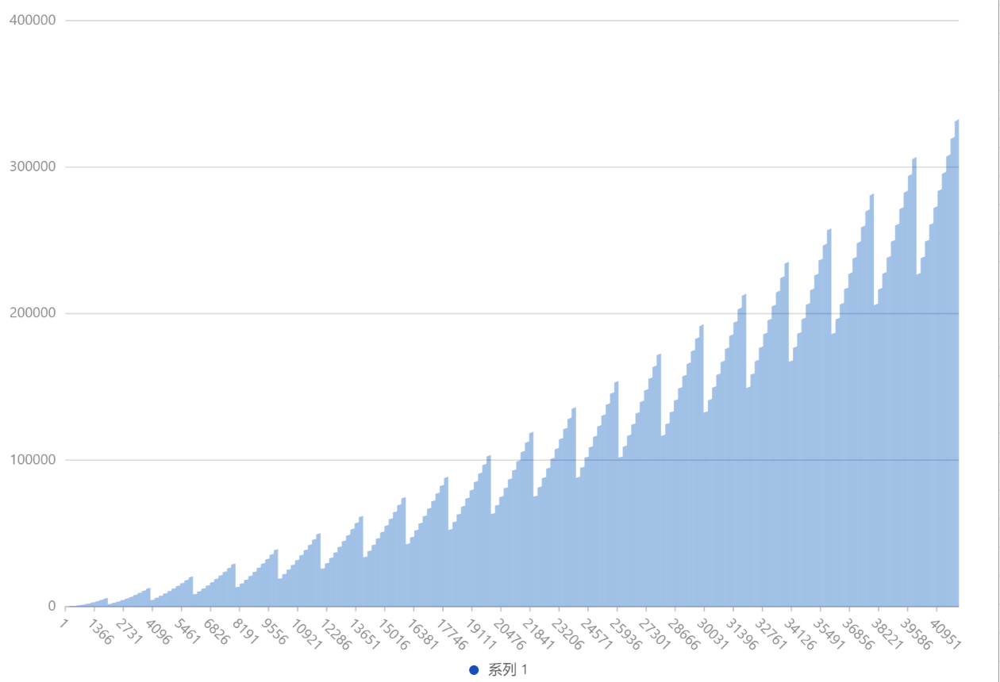
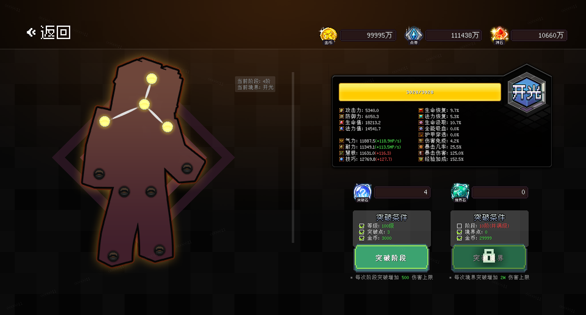

# JustLevel

> 角色等级系统
#### 等级经验曲线



#### API
```yaml
`JustLevelAPI`

# 获取玩家等级账户
getUserData(Player player);
getUserData(UUID uuid);
# 获取玩家境界
getRealm(Player player);
getRealm(UUID uuid);
# 获取玩家阶段
getStage(Player Player);
getStage(UUID uuid);
# 获取玩家总阶段
getTotalStage(Player player);
getTotalStage(UUID uuid);
# 获取玩家等级
getLevel(Player player);
getLevel(UUID uuid);
# 获取玩家当前经验
getExp(Player player);
getExp(UUID uuid);
# 获取玩家总等级
getTotalLevel(Player player);
getTotalLevel(UUID uuid);
```

#### Event
```yaml
# 玩家数据加载完成事件
PlayerDataLoadEvent
# 玩家境界突破事件
PlayerBrokenEvent.Realm
# 玩家阶段突破事件
PlayerBrokenEvent.Stage
# 玩家经验变化事件
PlayerExpChangeEvent
# 玩家经验增加事件
PlayerExpIncreaseEvent
# 玩家等级变化事件
PlayerLevelChangeEvent
```